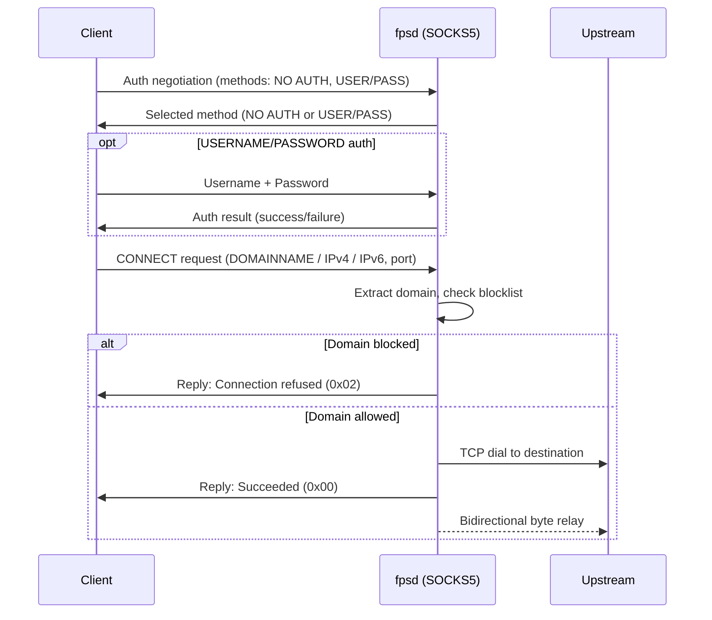

# Spec 023: SOCKS5 and FTP Proxying

**Status**: DRAFT
**Created**: 2026-02-25
**Depends on**: Spec 001 (proxy foundation), Spec 002 (domain blocklist), Spec 003 (config file), Spec 004 (database stats)

---

## Problem Statement

fpsd currently supports two proxy modes: explicit HTTP proxy (CONNECT tunneling for HTTPS) and transparent proxying (iptables-redirected traffic). Both modes handle HTTP and HTTPS well, but some client applications and use cases fall outside these protocols:

1. **SOCKS5**: macOS and iOS expose a system-wide SOCKS proxy setting separate from the HTTP proxy setting. Some applications (SSH clients, FTP clients, IRC clients, certain games) use SOCKS but not HTTP CONNECT. Adding a SOCKS5 listener lets fpsd handle these connections — applying domain blocking and stats tracking — without requiring transparent mode or iptables configuration.

2. **FTP**: FTP remains in use for file downloads, firmware updates, and legacy systems. FTP traffic currently passes through fpsd only via transparent mode (iptables redirecting port 21). Adding explicit FTP awareness to the SOCKS5 handler and transparent listener lets fpsd block FTP connections to blocked domains and track FTP traffic in stats.

Neither protocol requires MITM or content inspection — SOCKS5 and FTP support is about connection-level domain blocking and traffic visibility, not content filtering.

### Why SOCKS5, Not SOCKS4

SOCKS5 (RFC 1928) supports domain name resolution by the proxy, authentication, and IPv6. SOCKS4 requires the client to resolve domains before connecting, which means fpsd would see only IP addresses — no domain names to match against the blocklist. SOCKS5's DOMAINNAME address type lets the client send `www.example.com` directly, and fpsd resolves it after checking the blocklist. SOCKS4a exists as a workaround but is non-standard. SOCKS5 is the protocol that clients actually implement.

---

## Approach

### SOCKS5 Listener

A new TCP listener handles the SOCKS5 protocol. It runs alongside the existing explicit proxy and transparent listeners. The lifecycle is identical: started during proxy initialization, shut down during graceful shutdown.

#### SOCKS5 Handshake



#### Supported SOCKS5 Features

| Feature | Supported | Notes |
|---------|-----------|-------|
| CONNECT command (0x01) | Yes | TCP tunneling — the primary use case |
| BIND command (0x02) | No | Incoming connections — niche, complex, not needed for ad blocking |
| UDP ASSOCIATE (0x03) | No | Would require UDP relay — significant complexity for minimal blocking value |
| NO AUTHENTICATION (0x00) | Yes | Default when no credentials configured |
| USERNAME/PASSWORD (0x02) | Yes | RFC 1929, enabled when `socks5.username` and `socks5.password` are set |
| GSSAPI (0x01) | No | Enterprise Kerberos — out of scope |
| IPv4 address type (0x01) | Yes | Client provides resolved IP |
| DOMAINNAME address type (0x03) | Yes | Client provides hostname — enables blocklist matching |
| IPv6 address type (0x04) | Yes | Client provides resolved IPv6 |

BIND and UDP ASSOCIATE requests receive a "Command not supported" reply (0x07). This is compliant — SOCKS5 servers are not required to support all commands.

#### Domain Extraction

SOCKS5 CONNECT requests include an address type and destination:

- **DOMAINNAME (0x03)**: The hostname is in the request. Check blocklist directly.
- **IPv4 (0x01) or IPv6 (0x04)**: The client already resolved the domain. fpsd does a reverse DNS lookup (best-effort PTR query) to recover the domain for blocklist matching and stats. If reverse DNS fails, the connection proceeds — blocking by IP is not in scope (blocklists are domain-based).

This mirrors how the transparent HTTPS handler recovers domains from SNI — best-effort extraction, fail-open for unresolvable addresses.

### FTP Awareness

FTP support is limited to connection-level blocking and stats. fpsd does not implement an FTP proxy protocol or parse FTP commands.

#### FTP via SOCKS5

When a client sends a SOCKS5 CONNECT to port 21 (or any port), fpsd handles it identically to any other CONNECT — the domain is checked against the blocklist, the connection is tunneled if allowed. The FTP control channel and data channels flow through the SOCKS5 tunnel opaquely.

fpsd tags connections to port 21 as `ftp` in stats (protocol field) so they are visible separately from generic TCP connections.

#### FTP via Transparent Mode

The transparent listener already handles arbitrary TCP via iptables redirection. To support FTP:

1. Add a configurable transparent FTP port (default `:18721`) that accepts iptables-redirected port 21 traffic.
2. On connection accept, recover the original destination via `SO_ORIGINAL_DST`.
3. Extract the domain via reverse DNS on the original destination IP (best-effort, same as SOCKS5 IPv4 handling).
4. Check the blocklist. If blocked, close the connection. If allowed, dial upstream and relay bytes bidirectionally.

This is a simple TCP tunnel — no FTP protocol parsing. Active FTP (server connecting back to client) works only if the client uses passive mode, which is the default for all modern FTP clients behind NAT.

Active FTP's PORT/EPRT commands embed the client's IP and a dynamic port, which requires an ALG (Application Layer Gateway) to rewrite. fpsd does not implement an FTP ALG. Active FTP through fpsd will fail. This is acceptable — passive mode is universal, and active FTP through any proxy or NAT has the same limitation.

### Stats Integration

SOCKS5 and transparent FTP connections feed into the existing stats collector using the same `OnRequest` / `OnTunnelClose` callbacks. New fields:

| Stat | Description |
|------|-------------|
| `socks5_connections_total` | Total SOCKS5 CONNECT requests handled |
| `socks5_connections_active` | Currently open SOCKS5 tunnels |
| `socks5_auth_failures` | Failed authentication attempts |
| `ftp_connections_total` | Connections to port 21 (SOCKS5 or transparent) |

These appear in the `/fps/stats` endpoint and the dashboard Filtering card (Spec 022). The dashboard shows a "SOCKS5" section in the Filtering card (conditional, like MITM) when the SOCKS5 listener is enabled.

### Config

```yaml
socks5:
  enabled: false                 # SOCKS5 listener toggle
  addr: ":1080"                  # Listen address (1080 is the conventional SOCKS port)
  username: ""                   # Empty = no auth required
  password: ""                   # Both must be set to enable auth

transparent:
  enabled: false
  http_addr: ":18780"
  https_addr: ":18443"
  ftp_addr: ":18721"             # NEW — transparent FTP port (empty string = disabled)
```

The SOCKS5 listener is independent of transparent mode. Both can be enabled simultaneously. The transparent FTP port is part of the `transparent` section because it uses the same iptables + `SO_ORIGINAL_DST` mechanism as the existing transparent listeners.

---

## Scope

### In Scope

- SOCKS5 listener with CONNECT command support
- NO AUTH and USERNAME/PASSWORD authentication methods
- IPv4, IPv6, and DOMAINNAME address types
- Domain blocklist checking for SOCKS5 connections
- Best-effort reverse DNS for IP-only SOCKS5 requests
- Stats tracking for SOCKS5 connections (total, active, auth failures)
- Transparent FTP listener (TCP tunnel with blocklist check)
- Stats tracking for FTP connections
- Config additions for `socks5` section and `transparent.ftp_addr`
- Dashboard: conditional SOCKS5 section in Filtering card
- Graceful shutdown integration for new listeners

### Out of Scope

- SOCKS5 BIND command
- SOCKS5 UDP ASSOCIATE command
- GSSAPI or other authentication methods beyond username/password
- FTP protocol parsing (PORT/PASV/commands)
- FTP active mode ALG
- FTP over TLS (FTPS) interception
- MITM for SOCKS5-tunneled HTTPS (SOCKS5 tunnels are opaque byte streams)
- IP-based blocklists (domain-only matching continues)
- SOCKS4 / SOCKS4a support

---

## Design

### 1. Package Structure

New package: `internal/socks5/`

| File | Purpose |
|------|---------|
| `server.go` | `Server` struct, TCP listener, accept loop, graceful shutdown |
| `handshake.go` | Auth negotiation, request parsing, reply encoding |
| `tunnel.go` | Bidirectional byte relay (shared pattern with proxy/transparent) |

The transparent FTP listener is added to the existing `internal/transparent/` package as a new method on `Listener`, since it reuses the same `SO_ORIGINAL_DST` plumbing.

### 2. SOCKS5 Server

```go
// internal/socks5/server.go

type Server struct {
    Addr     string
    Username string           // empty = no auth
    Password string
    Blocker  blocker.Blocker
    Stats    *stats.Collector
    Logger   *slog.Logger
    // internal
    listener net.Listener
}

func (s *Server) ListenAndServe(ctx context.Context) error
func (s *Server) Shutdown(ctx context.Context) error
```

`ListenAndServe` binds the address, accepts connections in a goroutine-per-connection model (same pattern as the transparent listener), and processes the SOCKS5 handshake. Each connection follows:

1. Read version identifier (must be `0x05`)
2. Read client's offered auth methods
3. Select method: USERNAME/PASSWORD if configured, NO AUTH otherwise
4. If USERNAME/PASSWORD: read credentials, validate, send result
5. Read CONNECT request
6. Extract destination address and port
7. Check blocklist (domain name from DOMAINNAME type, or reverse DNS for IPv4/IPv6)
8. If blocked: send reply with "connection refused" (0x02), close
9. If allowed: dial upstream, send success reply with bound address, relay bytes

Unsupported commands (BIND, UDP ASSOCIATE) get reply code 0x07 (command not supported).

### 3. SOCKS5 Protocol Details (RFC 1928)

#### Auth Negotiation

```
Client → Server:
  +----+----------+----------+
  |VER | NMETHODS | METHODS  |
  +----+----------+----------+
  | 1  |    1     | 1 to 255 |
  +----+----------+----------+

Server → Client:
  +----+--------+
  |VER | METHOD |
  +----+--------+
  | 1  |   1    |
  +----+--------+
```

If the server requires USERNAME/PASSWORD but the client does not offer it, the server replies with `0xFF` (no acceptable methods) and closes the connection.

#### USERNAME/PASSWORD Auth (RFC 1929)

```
Client → Server:
  +----+------+----------+------+----------+
  |VER | ULEN |  UNAME   | PLEN |  PASSWD  |
  +----+------+----------+------+----------+
  | 1  |  1   | 1 to 255 |  1   | 1 to 255 |
  +----+------+----------+------+----------+

Server → Client:
  +----+--------+
  |VER | STATUS |
  +----+--------+
  | 1  |   1    |
  +----+--------+
```

VER is `0x01` (sub-negotiation version). STATUS `0x00` = success, anything else = failure (close connection).

Credentials are compared using constant-time comparison (`crypto/subtle.ConstantTimeCompare`) to avoid timing side-channels.

#### CONNECT Request

```
Client → Server:
  +----+-----+-------+------+----------+----------+
  |VER | CMD |  RSV  | ATYP | DST.ADDR | DST.PORT |
  +----+-----+-------+------+----------+----------+
  | 1  |  1  | X'00' |  1   | Variable |    2     |
  +----+-----+-------+------+----------+----------+
```

ATYP values:
- `0x01`: IPv4 (4 bytes)
- `0x03`: DOMAINNAME (1 byte length + N bytes)
- `0x04`: IPv6 (16 bytes)

#### Reply

```
Server → Client:
  +----+-----+-------+------+----------+----------+
  |VER | REP |  RSV  | ATYP | BND.ADDR | BND.PORT |
  +----+-----+-------+------+----------+----------+
  | 1  |  1  | X'00' |  1   | Variable |    2     |
  +----+-----+-------+------+----------+----------+
```

REP values used by fpsd:
- `0x00`: succeeded
- `0x02`: connection not allowed by ruleset (blocked domain)
- `0x04`: host unreachable (upstream dial failed)
- `0x05`: connection refused (upstream refused)
- `0x07`: command not supported (BIND, UDP ASSOCIATE)

BND.ADDR and BND.PORT are set to the local address of the upstream connection (or zeros on failure).

### 4. Transparent FTP Listener

Added to `internal/transparent/listener.go`:

```go
func (l *Listener) ListenFTP(ctx context.Context) error
```

Follows the same pattern as `ListenHTTPS`:
1. Accept TCP connection
2. Recover original destination via `SO_ORIGINAL_DST`
3. Reverse DNS on the destination IP to recover domain (best-effort)
4. Check blocklist
5. Dial upstream original destination on port 21
6. Bidirectional byte relay with stats tracking

The `handleFTP` method is simpler than `handleHTTPS` because there is no SNI extraction or MITM decision — it is a pure TCP tunnel.

### 5. Bidirectional Relay

Both the SOCKS5 tunnel and the transparent FTP tunnel need bidirectional byte copying with:
- Deadline management (idle timeout)
- Byte counting for stats
- Graceful half-close handling

The existing transparent listener uses an inline `io.Copy` pair in goroutines. The SOCKS5 server needs the same pattern. Extract a shared helper:

```go
// internal/relay/relay.go

func Bidirectional(client, upstream net.Conn, onClose func(sent, recv int64)) error
```

This replaces the inline relay code in `internal/transparent/listener.go` and is used by `internal/socks5/tunnel.go`. The transparent and proxy packages adopt it too, reducing duplication.

### 6. Reverse DNS Helper

```go
// internal/resolve/reverse.go

func ReverseLookup(ctx context.Context, ip net.IP) (string, error)
```

Uses `net.DefaultResolver.LookupAddr` with a short timeout (2s). Returns the first PTR result with the trailing dot removed, or an error if no PTR record exists. Used by both SOCKS5 (IPv4/IPv6 address types) and transparent FTP (SO_ORIGINAL_DST recovery).

This is best-effort. When reverse DNS fails, the caller logs a debug message and proceeds without a domain — the connection is allowed (fail-open), and stats record the raw IP instead of a domain name.

### 7. Startup Integration

In `cmd/fpsd/main.go`, the `runProxy` function adds:

```go
// After transparent listener setup:
if cfg.SOCKS5.Enabled {
    socks5Srv := &socks5.Server{
        Addr:     cfg.SOCKS5.Addr,
        Username: cfg.SOCKS5.Username,
        Password: cfg.SOCKS5.Password,
        Blocker:  blk,
        Stats:    statsCollector,
        Logger:   logger.With("component", "socks5"),
    }
    go func() { ... }() // ListenAndServe in goroutine
    // Register for graceful shutdown
}
```

The SOCKS5 listener starts after the blocklist and stats are initialized but does not depend on MITM or plugins (SOCKS5 tunnels are opaque).

### 8. iptables Rules for Transparent FTP

The `fpsd-tproxy` systemd service (managed by fps-ctl) needs an additional rule when transparent FTP is enabled:

```bash
iptables -t nat -A PREROUTING -i $IFACE -p tcp --dport 21 \
    -j REDIRECT --to-port 18721
```

fps-ctl reads the config to determine whether to add the FTP rule. The rule is omitted when `transparent.ftp_addr` is empty.

---

## Implementation Plan

### Commit 1: Add bidirectional relay helper

Extract the inline `io.Copy` goroutine pair from `internal/transparent/listener.go` into `internal/relay/relay.go`. Update the transparent listener to use the shared helper. Add tests for the relay (normal close, half-close, byte counting).

### Commit 2: Add reverse DNS helper

Create `internal/resolve/reverse.go` with `ReverseLookup`. Add tests using a mock resolver. This is a small utility used by later commits.

### Commit 3: Implement SOCKS5 server

Create `internal/socks5/` package with `server.go`, `handshake.go`, `tunnel.go`. Implement the SOCKS5 protocol (auth negotiation, CONNECT handling, blocklist integration, stats callbacks). Add config fields. Wire into `runProxy` startup and shutdown.

Tests:
- Handshake parsing (all address types, auth methods)
- Auth negotiation (no auth, valid credentials, invalid credentials, method mismatch)
- CONNECT to allowed domain (end-to-end with a test TCP server)
- CONNECT to blocked domain (verify reply code 0x02)
- Unsupported command (verify reply code 0x07)
- Graceful shutdown mid-connection

### Commit 4: Add transparent FTP listener

Add `ListenFTP` / `handleFTP` to `internal/transparent/listener.go`. Add `ftp_addr` config field. Wire into transparent listener startup. Update fps-ctl iptables rules.

Tests:
- FTP tunnel establishment with mock upstream
- Blocklist check on reverse-DNS-resolved domain
- Stats tracking (ftp protocol tag)
- Connection close when blocked

### Commit 5: Dashboard SOCKS5 stats section

Add a conditional "SOCKS5" section to the Filtering card (Spec 022 layout) showing total connections, active connections, and auth failures. Add FTP connection count to the existing stats. Update WebSocket stats payload to include the new counters.

---

## Test Strategy

### Automated (Go tests)

- **SOCKS5 handshake parsing**: Unit tests for all address types (IPv4, IPv6, DOMAINNAME), auth methods (NO AUTH, USERNAME/PASSWORD), and error cases (wrong version, truncated messages, unsupported commands)
- **SOCKS5 auth**: Valid credentials, invalid credentials, no-auth-when-none-configured, auth-required-but-not-offered
- **SOCKS5 end-to-end**: Start a SOCKS5 server and a test TCP server, connect through the SOCKS5 server, verify data passes bidirectionally
- **Blocklist integration**: SOCKS5 CONNECT to a blocked domain returns reply code 0x02
- **Relay helper**: Normal relay, half-close, byte counting accuracy, context cancellation
- **Reverse DNS**: Mock resolver returning PTR records, no-PTR-record case, timeout case
- **Transparent FTP**: Test using the same pattern as existing transparent tests (mock SO_ORIGINAL_DST not feasible — test the handler logic with injected destination)
- **Config parsing**: New fields parsed correctly, defaults applied

### Manual Verification

- Configure macOS SOCKS proxy to point at fpsd:1080, verify web browsing works
- Verify blocked domains are refused (Safari shows connection error)
- Connect an FTP client through SOCKS5 to a test FTP server, verify file transfer works
- Verify `/fps/stats` includes SOCKS5 and FTP counters
- Dashboard shows SOCKS5 section in Filtering card when enabled
- Dashboard hides SOCKS5 section when disabled
- `curl --socks5-hostname fpsd:1080 http://example.com` succeeds
- `curl --socks5-hostname fpsd:1080 http://blocked-domain.com` fails

---

## Acceptance Criteria

- [ ] SOCKS5 listener starts on configured address when `socks5.enabled` is true
- [ ] SOCKS5 CONNECT works for DOMAINNAME, IPv4, and IPv6 address types
- [ ] NO AUTH method works when no credentials configured
- [ ] USERNAME/PASSWORD auth works when credentials configured
- [ ] Auth failure returns appropriate SOCKS5 error and closes connection
- [ ] SOCKS5 CONNECT to a blocked domain returns reply code 0x02 (connection not allowed)
- [ ] SOCKS5 BIND and UDP ASSOCIATE return reply code 0x07 (command not supported)
- [ ] SOCKS5 connections appear in stats (`socks5_connections_total`, `socks5_connections_active`)
- [ ] Failed auth attempts tracked in `socks5_auth_failures` stat
- [ ] Transparent FTP listener starts when `transparent.ftp_addr` is set and transparent mode is enabled
- [ ] Transparent FTP checks blocklist via reverse DNS on original destination
- [ ] FTP connections appear in stats with `ftp` protocol tag
- [ ] Bidirectional relay helper extracted and used by SOCKS5, transparent FTP, and existing transparent code
- [ ] Reverse DNS helper with configurable timeout and fail-open behavior
- [ ] Config file accepts `socks5` section and `transparent.ftp_addr` field
- [ ] Dashboard Filtering card shows conditional SOCKS5 section (like MITM section)
- [ ] Graceful shutdown closes SOCKS5 listener and drains active connections
- [ ] `make test` passes
- [ ] `make lint` passes
- [ ] `curl --socks5-hostname` works against fpsd for both allowed and blocked domains

---

## Non-Goals

- Full FTP proxy implementation (PORT/PASV rewriting, directory listing filtering)
- SOCKS4 or SOCKS4a support
- UDP proxying (SOCKS5 UDP ASSOCIATE)
- MITM inspection of traffic tunneled through SOCKS5
- IP-based blocklists (reverse DNS is best-effort, fail-open)
- FTP over TLS (FTPS) interception
- Active FTP ALG
- SOCKS5 chaining (proxy-to-proxy)
